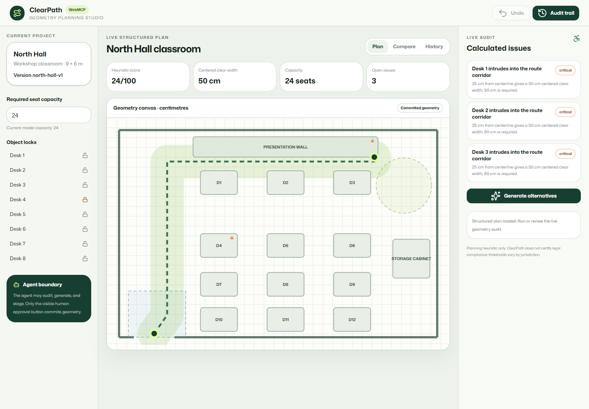

# ClearPath

[](https://github.com/MaharMuavia/clearpath-webmcp/actions/workflows/ci.yml)

**ClearPath is a WebMCP-native accessibility planning studio that audits real floor-plan geometry, searches constraint-safe layout alternatives, and keeps every change human-approved and undoable.**

[Open the live application](https://clearpath-access.hanzlakhan2266.chatgpt.site) · [Launch the studio](https://clearpath-access.hanzlakhan2266.chatgpt.site/studio)



## Why WebMCP is essential

A screenshot does not reliably expose centimetre coordinates, object identity, route topology, locked state, capacity contribution, required turning zones, version lineage, or exact metric deltas. ClearPath exposes those semantics through focused page-scoped tools. The visible interface and the tools use the same typed geometry, audit functions, proposal engine, and version state.

The application remains fully usable in browsers without WebMCP.

## Human-agent workflow

1. Open the live structured classroom plan.
2. Audit route intersections, clearance, turning space, door approach, capacity, and route length.
3. Focus a measured issue on the shared SVG canvas.
4. Lock movable objects and set the minimum seat capacity.
5. Generate ranked, genuinely different alternatives.
6. Stage one alternative as a ghost preview; committed geometry does not change.
7. Compare exact coordinates, metrics, deltas, resolved issues, and trade-offs.
8. A human approves or rejects the staged plan.
9. An approved version can be undone to the exact previous geometry.

## Architecture

```text
Typed classroom geometry
  ├─ deterministic audit + heuristic score
  ├─ bounded beam search + lexicographic ranking
  ├─ model-driven SVG + comparison UI
  ├─ versioned session + immutable audit events
  └─ studio-only WebMCP imperative tools
```

- `lib/planning-engine.ts` owns domain types, geometry primitives, audit calculations, scoring, and proposal search.
- `lib/planning-session.ts` owns committed/staged state, stale-proposal checks, history, rejection, apply, and exact undo.
- `components/studio/clearpath-studio.tsx` renders the plan directly from current model data and provides the complete human workflow.
- `hooks/use-clearpath-tools.ts` exposes the same state/actions using `document.modelContext.registerTool()` with execution-boundary validation and abort-based cleanup.

## Real geometry and scoring

The model uses centimetres and includes plan bounds, walls, route points, objects, rotations, locks, capacity contributions, a 150 cm turning zone, and an entrance approach/recovery zone.

The audit calculates segment/rectangle intersection, centreline-to-obstacle distance, centred available clear width, wall clearance, circle/rectangle overlap, rectangle overlap, route length, active capacity, and changed-object count. Every visible metric is recalculated from the visible plan. It reports every object intruding into the required corridor, even when the object does not intersect the route centreline.

The explainable planning heuristic starts at 100 and subtracts:

- 22 per critical conflict;
- 7 per review conflict;
- 0.25 per centimetre below the configured 90 cm clear-width planning threshold;
- 2 per moved object; and
- 4 per lost seat relative to baseline.

Scores are clamped to 0–100. This is a planning heuristic, not legal certification. Requirements vary by jurisdiction.

Proposal generation uses a deterministic beam search over geometry-implicated movable objects, bounded candidate positions, explicit desk-removal and restoration candidates, incremental validation, duplicate-state elimination, a maximum depth of four changes, a beam width of 72, and a 1,500-state evaluation cap. It ranks lexicographically: route blockers, required clear width, other critical conflicts, review issues, required capacity, changed-object count, movement distance, then route length. A proposal is labelled **Threshold satisfied** only when it has zero critical issues, reaches the 90 cm planning threshold, and preserves the configured capacity; all other useful results are labelled **Partial improvement**.

## WebMCP tools

Tools register only on `/studio`. Generation-dependent, staged-plan, and undo tools register only while their corresponding state exists. `apply_staged_plan` records an agent approval request and opens the human approval gate; it never commits geometry.

| Tool | Mode | Purpose |
| --- | --- | --- |
| `get_plan_summary` | Read | Current versions, constraints, calculated metrics, and issue IDs |
| `get_plan_geometry` | Read | Dimensions, route, objects, locks, capacity, and required zones |
| `audit_access_routes` | Read | Recalculate and filter geometry-derived issues |
| `focus_audit_issue` | UI action | Focus an open issue on the canvas |
| `set_planning_constraints` | Mutate | Set minimum capacity and invalidate stale proposals |
| `generate_route_alternatives` | Mutate | Run bounded deterministic search |
| `stage_route_proposal` | Mutate | Stage a proposal without changing committed geometry |
| `compare_plan_versions` | Read | Before/after metrics, status, exact move/removal/restoration changes, issues, and trade-offs |
| `apply_staged_plan` | Approval request | Open the visible human approval gate; never commits silently |
| `reject_staged_plan` | Mutate | Reject the staged proposal exactly |
| `undo_plan_change` | Mutate | Restore the prior committed geometry |
| `get_audit_history` | Read | Return real chronological event records |

All schemas use `additionalProperties: false`; inputs are validated again inside `execute`; registrations are cleaned up with `AbortSignal`; read-only annotations reflect actual behavior.

## Safety model

- Locked objects never move.
- Capacity, boundaries, and object overlap are hard constraints.
- Failed searches do not mutate current state.
- Proposal IDs are bound to a deterministic fingerprint of geometry, version, locks, capacity constraint, and thresholds; stale/rejected IDs cannot stage or apply.
- Agent apply calls only request visible human approval.
- Apply stores the exact prior plan; undo restores it rather than reconstructing it.
- Real audit events record actor, action, plan/proposal IDs, versions, result, and timestamp.

## Evaluation

The checked evaluation separates automated WebMCP contract coverage from native ChatGPT selection: [EVALUATION.md](EVALUATION.md). Native natural-language verification remains pending until run in ChatGPT's WebMCP host.

## Local setup

Requires Node.js 22.13 or newer.

```bash
npm ci
npm run dev
```

Open the printed local URL. WebMCP is feature-detected; unsupported browsers use the same human interface without tool registration.

## Verification

```bash
npm run typecheck
npm run lint
npm test
npm run test:e2e
npm run build
npm audit --audit-level=high
```

CI runs type checking, lint, unit/integration tests, build, and Chromium end-to-end tests on pushes and pull requests.

## Limitations

- The implementation intentionally contains one deeply modeled classroom scenario. The former clinic and café were removed because they reused classroom visuals rather than independent geometry.
- Search is bounded and deterministic, not a general CAD optimizer.
- Objects are axis-aligned for collision checks; rotation is represented in the domain for extension but non-zero rotated collision polygons are not yet implemented.
- Planning thresholds are transparent defaults, not jurisdiction-specific code rules.
- State is local to the browser session; there is no multi-user persistence.

## Demo prompts

1. `Audit the current access route and focus the most severe measured issue.`
2. `I have locked Desk 8 in the visible interface. Preserve my current locks and all 24 seats, then generate the two best alternatives.`
3. `Stage the highest-ranked alternative and compare exact before-and-after metrics and coordinates.`
4. `Request approval for the staged plan, but do not commit anything without my visible approval.`
5. `Show the audit history, then undo the last approved plan change.`

## GitHub About settings

- **Description:** `WebMCP-native accessibility planning with real geometry audits, constraint-safe proposals, human approval, and exact undo.`
- **Homepage:** `https://clearpath-access.hanzlakhan2266.chatgpt.site`
- **Topics:** `webmcp`, `accessibility`, `computational-geometry`, `ai-agents`, `human-in-the-loop`, `nextjs`, `typescript`, `floor-plan`, `inclusive-design`, `hackathon`

## License

MIT. ClearPath is a planning aid, not a substitute for local code review or a qualified accessibility professional.
